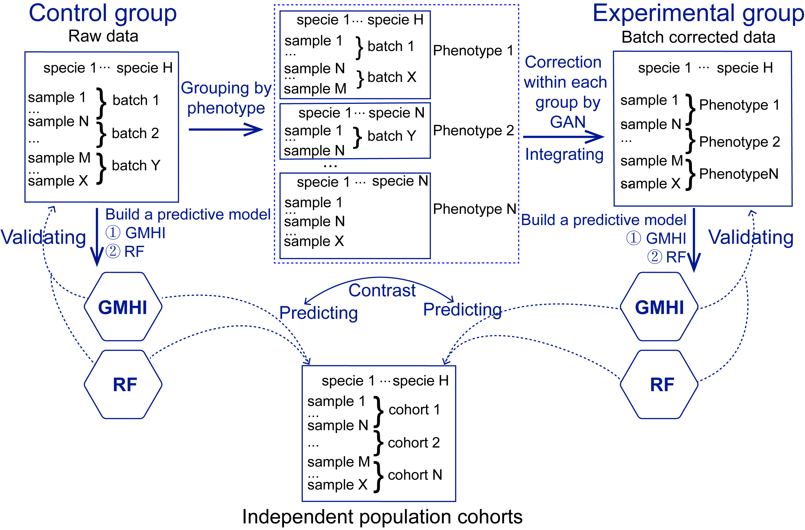

# GAN-GMHI
GAN-GMHI framework consists of three stages, constructing a dataset containing phenotype and batch information for all samples, and then GAN guiding the batch effect correction of raw data, the corrected datasets are output as the training data set for GMHI prediction (see Figure). It is worth noting that the datasets to be batch-corrected by GAN must be classified based on the phenotype first, and the sub-data sets of each phenotype are regrouped according to the batch. To ensure that the unwanted technical variations among different datasets are eliminated, but the biological differences between different phenotypes are not diminished.

## Install & Dependency
```shell
# clone this repository
git clone https://github.com/HUST-NingKang-Lab/GAN-GMHI.git
cd GAN-GMHI

# configure environment using environment.yaml
conda env create -n gangmhi -f environment.yaml
conda activate gangmhi
```


## Data
We have performed a comprehensive analysis on 2,636 healthy and 1,711 non-healthy (including 12 disease phenotypes) individuals’ stool metagenomes from 34 published studies (Gupta, et al.). The taxonomy abundance table is available at the `/data` directory.
## Scripts
The source codes used to reproduce all the results of this study is available at the `/scripts` directory.
## Demo
To remove the batch effects between samples from different studies, we used the GAN approach. This example will show you the entire batch effect removal process, all files and scripts are avaiable at the `/demo` directory.The batch effect removal (BER) process including two steps. 

First step, running the scipt `demo/GAN4BER.py` for each phenotype (disease) and this script will generate a taxonomy abundance table that the batch effect has been removed. Here, samples in five diseases are from multiple studies, including "CRC", "Crohns disease", "Obesity", "Overweight", and "T2D". Running the following commands.
```bash
python demo/GAN4BER.py "CRC"
python demo/GAN4BER.py "Crohns disease"
python demo/GAN4BER.py "Obesity"
python demo/GAN4BER.py "Overweight"
python demo/GAN4BER.py "T2D"
```

Second step, running the script `demo/Merge.py` to merge those taxonomy abundance tables produced in the first step. 
```bash
python demo/Merge.py "demo/output/Non-healthy-BER.csv"
```

For convenience, we provide the script `demo/run.sh` to perform all the steps.
```bash
bash demo/run.sh
```

